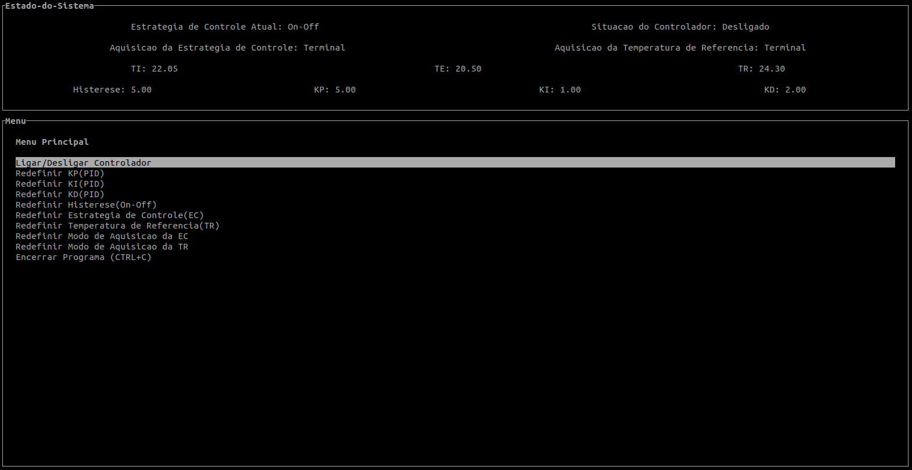
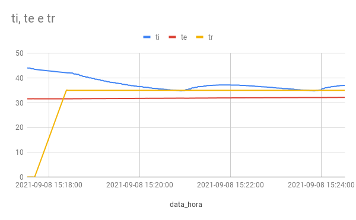
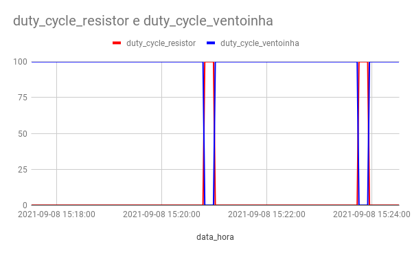
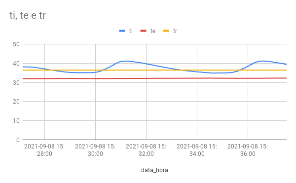
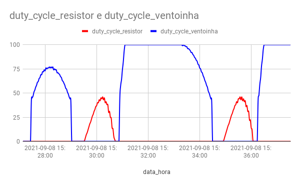

# Fundamentos de Sistemas Embarcados - Projeto 01

## Enunciado

https://gitlab.com/fse_fga/projetos_2021_1/projeto-1-2021-1

## Compilação

Para compilar, basta executar o comando:

```
$ make all
```

## Uso

Para executar o programa, basta abrir o terminal em tela cheia(F11) e executar o comando:

```
$ make run
```

Ao executar o programa será possível acompanhar e redefinir as variáveis do sistema, bem como ligar/desligar o controlador.

<p align="center">
    
</p>

## Gráficos On-Off

### Temperaturas

<p align="center">
    
</p>

### Duty Cycles

<p align="center">
    
</p>

## Gráficos PID

### Temperaturas

<p align="center">
    
</p>

### Duty Cycles

<p align="center">
    
</p>